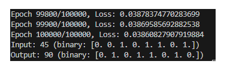

# Description

This example implements a simple neural network using PyTorch to learn the 
mapping of 8-bit binary numbers to their doubled values, modulo 256.

## Classes
    NeuralNet: Defines a neural network with one input layer of 8,
    a hidden 16 layer, and an output 8 layer.

## Functions
    * number_to_binary(num): Converts a number to its 8-bit binary representation.
    * binary_to_number(binary): Converts an 8-bit binary representation to a number.
    * generate_dataset(size): Generates a dataset of 8-bit binary numbers and their doubled values.

## Hyperparameters
    * learning_rate: The learning rate for the optimizer.
    * epochs: The number of training epochs.

## Usage:
    The script initializes the dataset, model, loss function, and optimizer.

    It then trains the model using the specified number of epochs and prints the loss every 100 epochs.

    Finally, it tests the model with an example input and prints the result.

